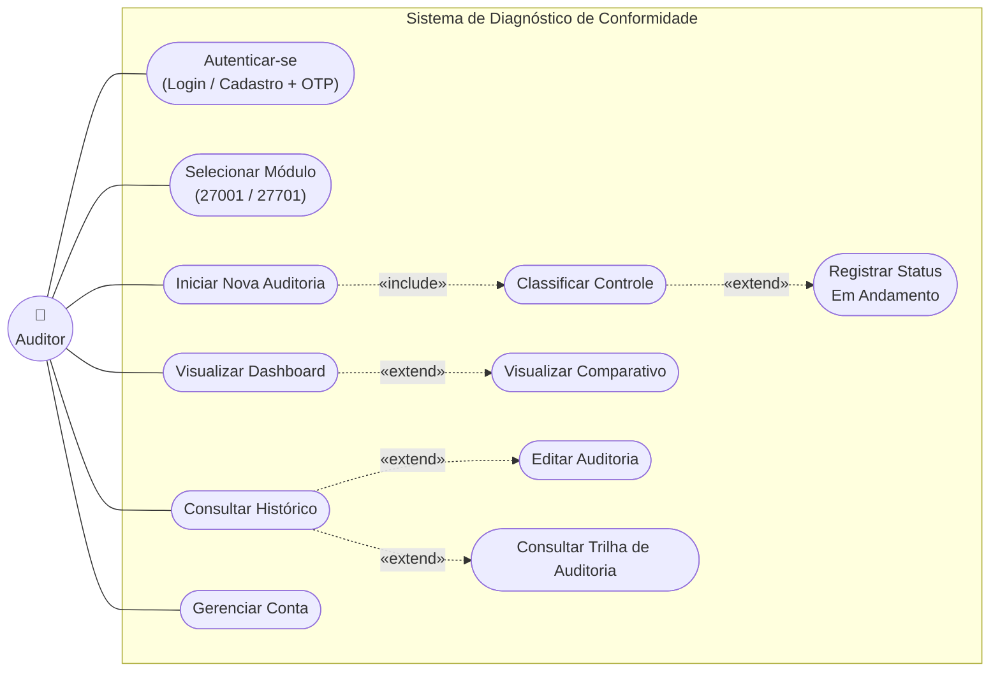
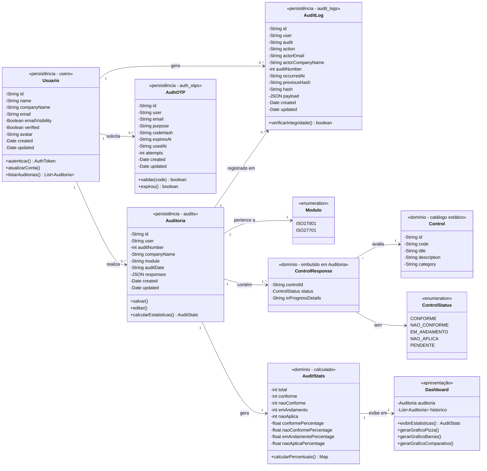
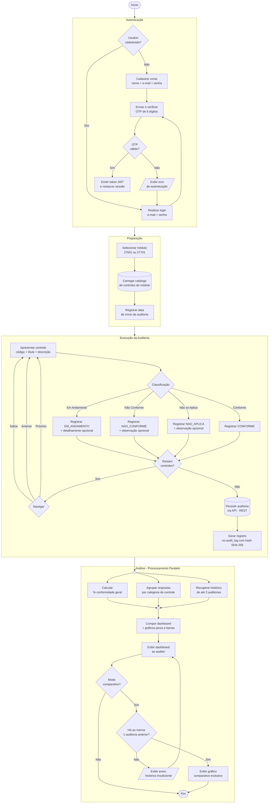

# Sistema de Diagnóstico de Conformidade ISO/IEC 27001 e 27701

> **Projeto de Segurança I (PSI)**: Ferramenta para diagnóstico de conformidade com as normas **ABNT NBR ISO/IEC 27001** (Sistema de Gestão de Segurança da Informação) e **ABNT NBR ISO/IEC 27701** (Sistema de Gestão da Privacidade da Informação), utilizando a **ABNT NBR ISO/IEC 27002** como base de avaliação para a conformidade da 27001.

---

## Sumário

- [Descrição do Sistema](#-descrição-do-sistema)
- [Objetivos](#-objetivos)
- [Requisitos Funcionais](#-requisitos-funcionais)
- [Requisitos Não Funcionais](#️-requisitos-não-funcionais)
- [Arquitetura Conceitual](#️-arquitetura-conceitual)
- [Diagramas UML](#-diagramas-uml)
  - [Diagrama de Casos de Uso](#diagrama-de-casos-de-uso)
  - [Diagrama de Classes](#diagrama-de-classes)
  - [Diagrama de Atividades](#diagrama-de-atividades)
- [Tecnologias](#️-tecnologias)
- [Referências](#-referências)

---

## Descrição do Sistema

O **Sistema de Diagnóstico de Conformidade ISO 27001/27701** é uma ferramenta acadêmica desenvolvida no contexto da disciplina **Projeto de Segurança I (PSI)** cujo objetivo é auxiliar auditores, profissionais de segurança da informação e responsáveis pelo programa de privacidade de uma organização a realizar **autoavaliações de conformidade** frente a duas das principais normas internacionais da família ISO/IEC 27000:

- **ABNT NBR ISO/IEC 27001**: Estabelece os requisitos para um Sistema de Gestão de Segurança da Informação (SGSI).
- **ABNT NBR ISO/IEC 27701:2026**: Estende a 27001 para a gestão da privacidade de informações pessoais, sendo a referência para um Sistema de Gestão da Privacidade da Informação (SGPI). É aplicável tanto a controladores quanto a operadores de dados pessoais (DP) e está mapeada à LGPD (Lei nº 13.709/2018).
- **ABNT NBR ISO/IEC 27002:2022**: Fornece o catálogo detalhado de controles utilizados como **base de diagnóstico** para a 27001, organizados em quatro temas (Organizacional, Pessoas, Físico e Tecnológico), totalizando 93 controles.

A ferramenta permite que o usuário **selecione o módulo de auditoria** (27001 ou 27701), inicie uma nova auditoria associada à sua conta, percorra todos os controles aplicáveis e classifique cada um como **Conforme**, **Não Conforme**, **Em Andamento** ou **Não se Aplica**. Ao final, os dados são consolidados em um **dashboard** com indicadores gerais e parciais por categoria de controle, além de permitir a **análise comparativa** com auditorias anteriores (até as 3 últimas). Todas as ações de criação e edição são registradas em uma **trilha de auditoria com encadeamento de hashes** (SHA-256), garantindo a integridade e rastreabilidade dos dados.

---

## Objetivos

- Permitir a realização de auditorias internas guiadas, baseadas nos controles da ABNT NBR ISO/IEC 27002 e do Anexo A da ABNT NBR ISO/IEC 27701.
- Apoiar o diagnóstico de **conformidade** organizacional para 27001 (segurança) e 27701 (privacidade).
- Consolidar os resultados em **dashboard visual** com gráficos de conformidade total e por categoria.
- Manter o **histórico das três últimas auditorias** para análise de evolução.
- Garantir a **integridade e auditabilidade** dos registros por meio de trilha de auditoria com hashes encadeados.

---

## Requisitos Funcionais

Os requisitos funcionais (RF) descrevem **o que o sistema deve fazer**, as funcionalidades observáveis pelo usuário final.

> 💡 *Clique em cada requisito para expandir os detalhes.*

<strong>RF01 - Autenticação de Usuário com OTP</strong>

 

O sistema deve exigir autenticação antes de qualquer acesso às funcionalidades de auditoria. O fluxo de autenticação inclui **cadastro** (nome da empresa, e-mail e senha) e **login** (e-mail e senha), ambos seguidos de **verificação por código OTP de 6 dígitos** enviado ao e-mail informado. O acesso a auditorias e dados históricos é restrito ao usuário autenticado.

- **Prioridade:** Essencial
- **Origem:** PSI - "Autenticar auditor"

<strong>RF02 - Seleção de Módulo Normativo</strong>

 

O sistema deve permitir que o usuário selecione, no início de cada auditoria, entre dois módulos mutuamente exclusivos: **ISO/IEC 27001** (segurança da informação) ou **ISO/IEC 27701** (privacidade da informação). A escolha do módulo determina o catálogo de controles que será carregado para a avaliação subsequente.

- **Prioridade:** Essencial
- **Origem:** PSI - "Um módulo para 27001 e outro para 27701"

<strong>RF03 - Carregamento do Catálogo de Controles</strong>

 

O sistema deve carregar automaticamente os controles aplicáveis ao módulo escolhido. Para o módulo **27001**, deve utilizar os 93 controles da **ISO/IEC 27002:2022**, distribuídos nos quatro temas (Organizacional, Pessoas, Físico e Tecnológico). Para o módulo **27701**, deve utilizar os controles do **Anexo A da ISO/IEC 27701:2026**, abrangendo as Tabelas A.1 (controladores), A.2 (operadores) e A.3 (considerações de segurança comuns).

- **Prioridade:** Essencial
- **Origem:** PSI - "Utilizar 27002 para diagnóstico da conformidade de 27001"

<strong>RF04 - Registro da Data da Auditoria</strong>

 

O sistema deve registrar a data de realização da auditoria, capturada automaticamente no momento de início, e associá-la ao registro da auditoria para fins de rastreabilidade temporal e comparativo histórico.

- **Prioridade:** Essencial
- **Origem:** PSI - "Armazenar os dados e data de auditoria"

<strong>RF05 - Classificação Individual de Controles</strong>

 

Para cada controle apresentado, o sistema deve permitir que o auditor atribua **uma única** das classificações mutuamente exclusivas: **Conforme**, **Não Conforme**, **Em Andamento** ou **Não se Aplica**. A classificação de "Em Andamento" identifica controles não conformes para os quais já existe trabalho de adequação em curso. O auditor pode complementar qualquer classificação com um **campo de observação textual opcional**.

- **Prioridade:** Essencial
- **Origem:** PSI - "Para cada controle, perguntar se está conforme, não conforme, em andamento ou não se aplica"

<strong>RF06 - Navegação Livre Entre Controles</strong>

 

Durante a execução da auditoria, o sistema deve permitir que o auditor navegue livremente entre os controles (avançar, retroceder e acessar diretamente por índice), podendo revisitar e alterar classificações já registradas antes de finalizar a auditoria.

- **Prioridade:** Essencial
- **Origem:** PSI - "Interface de auditoria sequencial e navegável"

<strong>RF07 - Persistência da Auditoria</strong>

 

Ao finalizar a avaliação dos controles, o sistema deve **persistir** todos os dados da auditoria (empresa, módulo, data, respostas, observações) via API no backend, garantindo que possam ser recuperados em sessões posteriores. A auditoria é identificada por um **número sequencial** por conta de usuário.

- **Prioridade:** Essencial
- **Origem:** PSI - "Armazenar os dados"

<strong>RF08 - Edição de Auditoria Existente</strong>

 

O sistema deve permitir que o usuário **edite** uma auditoria previamente salva, atualizando as classificações dos controles. Toda edição deve gerar um novo registro na trilha de auditoria (log), mantendo o histórico de alterações com hash encadeado.

- **Prioridade:** Essencial
- **Origem:** PSI - "Permitir revisão e atualização de auditorias"

<strong>RF09 - Manutenção de Histórico das 3 Últimas Auditorias</strong>

 

O sistema deve preservar, por combinação de **conta de usuário e módulo**, o registro das **três auditorias mais recentes** para fins de comparativo evolutivo. O histórico completo de auditorias permanece acessível na tela de Histórico.

- **Prioridade:** Essencial
- **Origem:** PSI - "Armazenar os dados e data de auditoria para efeitos comparativos (3 últimas auditorias)"

<strong>RF10 - Cálculo da Conformidade Geral</strong>

 

O sistema deve calcular o **percentual geral de conformidade** da auditoria, definido como a razão entre o número de controles classificados como "Conforme" e o total de controles **aplicáveis** (excluindo do denominador os classificados como "Não se Aplica"). Os status "Em Andamento" e "Não Conforme" são contabilizados separadamente nos indicadores.

- **Prioridade:** Essencial

<strong>RF11 - Cálculo da Conformidade por Categoria de Controle</strong>

 

O sistema deve calcular percentuais **parciais** de conformidade segregados por **categoria de controle**, conforme a taxonomia adotada pelo módulo: as quatro categorias da ISO/IEC 27002 para o módulo 27001 (Organizacional, Pessoas, Físico, Tecnológico) ou as categorias do Anexo A da ISO/IEC 27701 para o módulo de privacidade.

- **Prioridade:** Essencial
- **Origem:** PSI - "Agrupar os dados por tipos de controle (27002)"

<strong>RF12 - Dashboard de Conformidade</strong>

 

O sistema deve apresentar um **painel consolidado (dashboard)** exibindo simultaneamente: (i) cards com os totais e percentuais de cada status, (ii) gráfico de pizza com a distribuição geral de conformidade, e (iii) gráfico de barras comparando o percentual de conformidade entre as categorias de controle.

- **Prioridade:** Essencial
- **Origem:** PSI - "Apresentar os dados no formato de dashboard com gráficos (pizza ou barra)"

<strong>RF13 - Dashboard Comparativo</strong>

 

O dashboard deve oferecer uma **aba de modo comparativo**, exibindo a evolução dos indicadores de conformidade nas últimas auditorias do mesmo módulo. Quando não houver histórico suficiente, o sistema deve exibir mensagem informativa adequada.

- **Prioridade:** Essencial
- **Origem:** PSI - "Funcionalidade de comparativo / mostrar evolução de conformidade"

<strong>RF14 - Tela de Histórico de Auditorias</strong>

 

O sistema deve apresentar uma **tela de histórico** listando todas as auditorias realizadas pelo usuário, com data, módulo, número sequencial e indicadores resumidos. A partir do histórico, o auditor pode visualizar o dashboard de qualquer auditoria anterior, editá-la ou consultar sua trilha de auditoria.

- **Prioridade:** Essencial
- **Origem:** PSI - "Listar e consultar auditorias anteriores"

<strong>RF15 - Trilha de Auditoria com Integridade por Hash</strong>

 

Cada ação relevante sobre uma auditoria (criação ou edição) deve gerar um **registro de log imutável**, contendo: ator, data/hora, número da auditoria, hash SHA-256 do evento e hash do evento anterior (encadeamento). Isso garante rastreabilidade e permite detectar adulterações posteriores nos registros.

- **Prioridade:** Essencial
- **Origem:** PSI - "Auditabilidade e integridade dos registros"

<strong>RF16 - Gerenciamento de Conta</strong>

 

O sistema deve permitir que o usuário autenticado atualize os dados de sua conta: **nome da empresa**, **e-mail** e **senha**. A alteração de senha deve exigir a confirmação da senha atual antes de aplicar a nova.

- **Prioridade:** Importante
- **Origem:** PSI - "Gerenciamento de perfil de usuário"

---

## Requisitos Não Funcionais

Os requisitos não funcionais (RNF) descrevem **atributos de qualidade** do sistema, como ele deve se comportar e quais restrições deve respeitar.

> 💡 *Clique em cada requisito para expandir os detalhes.*

<strong>RNF01 - Usabilidade</strong>

 

Considerando que uma auditoria 27001 envolve a avaliação sequencial de até 93 controles, a interface deve ser **clara, objetiva e de baixa carga cognitiva**. Cada controle deve ser apresentado com seu código, título, descrição original da norma e as opções de classificação visíveis simultaneamente. A barra de progresso deve indicar continuamente o avanço da auditoria.

<strong>RNF02 - Confiabilidade dos Dados</strong>

 

Os dados da auditoria são persistidos via API ao final de cada sessão de preenchimento. A sessão do usuário é restaurada automaticamente entre recarregamentos de página por meio do token JWT armazenado localmente, garantindo que auditorias em andamento não sejam perdidas.

<strong>RNF03 - Segurança da Aplicação</strong>

 

O sistema adota múltiplas camadas de segurança alinhadas à ISO/IEC 27002, incluindo:

- **Autenticação em dois fatores (2FA)** via OTP de 6 dígitos por e-mail, com expiração e limite de tentativas.
- **Autorização baseada em token JWT**, com regras de acesso no backend que restringem cada usuário ao próprio conjunto de dados.
- **Registro imutável de eventos** (audit_logs) com encadeamento de hashes SHA-256 para garantir integridade.
- **Controle de acesso no nível de coleção** via regras do PocketBase (ListRule, ViewRule, CreateRule, UpdateRule, DeleteRule).

<strong>RNF04 - Conformidade Normativa do Catálogo</strong>

 

O catálogo de controles embutido na ferramenta reflete as **edições vigentes** das normas de referência: ABNT NBR ISO/IEC 27002:2022 e ABNT NBR ISO/IEC 27701:2026. Atualizações normativas podem ser incorporadas por meio de atualização dos arquivos de dados, sem impacto nos dados históricos persistidos.

<strong>RNF05 - Performance e Tempo de Resposta</strong>

 

Operações de leitura (carregamento de controles, exibição do dashboard, recuperação de histórico) devem responder em até **2 segundos** em carga típica. Operações de escrita (salvar ou editar auditoria) podem admitir até **3 segundos**, considerando a geração do hash e o registro do log.

<strong>RNF06 - Portabilidade e Implantação</strong>

 

O sistema deve poder ser executado em **navegadores web modernos** sem dependência de sistema operacional específico. A aplicação é completamente **conteinerizada via Docker** (frontend Next.js e backend PocketBase em contêineres separados, orquestrados por Docker Compose), facilitando a implantação em diferentes ambientes.

<strong>RNF07 - Manutenibilidade</strong>

 

A separação clara entre o **catálogo de controles** (arquivos de dados normativos), as **regras de cálculo de conformidade** (funções de domínio em `audit-utils.ts`) e a **camada de persistência** (API REST sobre PocketBase) deve permitir que evoluções em uma camada não impactem desnecessariamente as demais. A arquitetura é guiada pelo princípio de **separação de responsabilidades**.

<strong>RNF08 - Auditabilidade</strong>

 

Sendo a aplicação uma ferramenta de auditoria, o próprio sistema deve ser **auditável**: cada criação ou edição de auditoria gera um registro imutável em `audit_logs` com encadeamento de hashes SHA-256. O hash de cada evento é calculado sobre o payload completo da auditoria concatenado ao hash do evento anterior, formando uma **cadeia verificável** que detecta adulterações retroativas.

<strong>RNF09 - Idioma e Localização</strong>

 

A interface, o catálogo de controles e todos os textos do sistema devem estar em **português brasileiro**, refletindo a terminologia adotada pelas normas ABNT NBR e pela LGPD. Exemplos: "dados pessoais" em vez de "PII", "operador" e "controlador" em vez de "processor" e "controller".

<strong>RNF10 - Privacidade dos Dados de Auditoria</strong>

 

Os dados de auditoria, embora não sejam dados pessoais em sentido estrito, podem conter informações sensíveis sobre a postura de segurança das organizações avaliadas. O sistema adota **isolamento por conta de usuário** (cada usuário acessa apenas suas próprias auditorias), **controle de acesso no nível de registro** e boas práticas de **minimização de dados** - coerentes com as próprias normas que ele ajuda a avaliar.

---

## Arquitetura Conceitual

O sistema é estruturado em camadas:

- **Apresentação**: Interface do usuário em Next.js (React) - formulários de auditoria, dashboard com gráficos e tela de histórico.
- **Aplicação / Domínio**: Regras de negócio em TypeScript - classificação de controles, cálculo de percentuais de conformidade, comparação histórica, geração e verificação de hashes.
- **Persistência**: API REST sobre PocketBase com banco SQLite - armazena auditorias, respostas, logs de auditoria e dados de autenticação.

A separação entre **módulos** (27001 e 27701) e **categorias de controle** (temas da 27002 e categorias do Anexo A da 27701) é refletida diretamente no modelo de domínio e nos cálculos de conformidade.

---

## Diagramas UML

### Diagrama de Casos de Uso

Apresenta as interações entre o ator principal (**Auditor**) e as funcionalidades do sistema.

**Notas de leitura:**
- `«include»` indica que o caso de uso é **sempre** executado como parte do caso de uso de origem.
- `«extend»` indica execução **condicional** (somente quando a condição é satisfeita).

---

### Diagrama de Classes

Modelo de domínio do sistema. As quatro classes de persistência refletem diretamente as coleções do banco de dados (PocketBase/SQLite). As demais representam entidades de domínio e lógica de negócio tratadas na camada de aplicação.
 

 
**Principais relacionamentos:**
- As classes `Usuario`, `Auditoria`, `AuditLog` e `AuthOTP` correspondem diretamente às coleções persistidas no banco de dados.
- `ControlResponse` é serializada como JSON dentro do campo `responses` de `Auditoria`, sem tabela própria.
- `Control` representa o catálogo normativo estático (arquivos de dados), não persistido no banco.
- `AuditLog` encadeia registros por `previousHash`, formando uma trilha SHA-256 verificável que detecta adulterações retroativas.

---

### Diagrama de Atividades

O fluxo completo da ferramenta cobre quatro fases: Autenticação, Preparação, Execução e Análise. A fase de análise inclui **processamento paralelo** (cálculo de indicadores, agrupamento por categoria e recuperação do histórico ocorrem de forma concorrente) e **tratamento de exceção** quando não há histórico suficiente para o comparativo.

**Pontos de atenção do fluxo:**
- A fase de **Autenticação** inclui verificação por OTP com limite de tentativas, garantindo segurança no acesso.
- A fase de **Execução** permite navegação livre entre controles (próximo, anterior ou por índice), sem ordem obrigatória.
- A **Fase 3** modela explicitamente o paralelismo entre cálculo de indicadores, agrupamento e recuperação do histórico.
- O **modo comparativo** trata a exceção de histórico insuficiente, exibindo aviso ao invés de quebrar o fluxo.

---

## Tecnologias

- **Back-end:** Go, PocketBase, SQLite.
- **Front-end:** Next.js, React, Tailwind CSS, shadcn/ui.
- **Visualização (gráficos):** Recharts.
- **Conteinerização:** Docker, Docker Compose.

---

## Referências

- **ABNT NBR ISO/IEC 27002:2022** - *Segurança da informação, segurança cibernética e proteção da privacidade - Controles de segurança da informação.* Rio de Janeiro: ABNT, 2022.

- **ABNT NBR ISO/IEC 27701:2026** - *Segurança da informação, segurança cibernética e proteção da privacidade - Sistemas de gestão da privacidade da informação - Requisitos e orientações.* 2ª edição. Rio de Janeiro: ABNT, 22 jan. 2026. 90 p. ICS 03.100.70; 35.030. Adoção idêntica da ISO/IEC 27701:2025. Cancela e substitui a ABNT NBR ISO/IEC 27701:2020.

---
