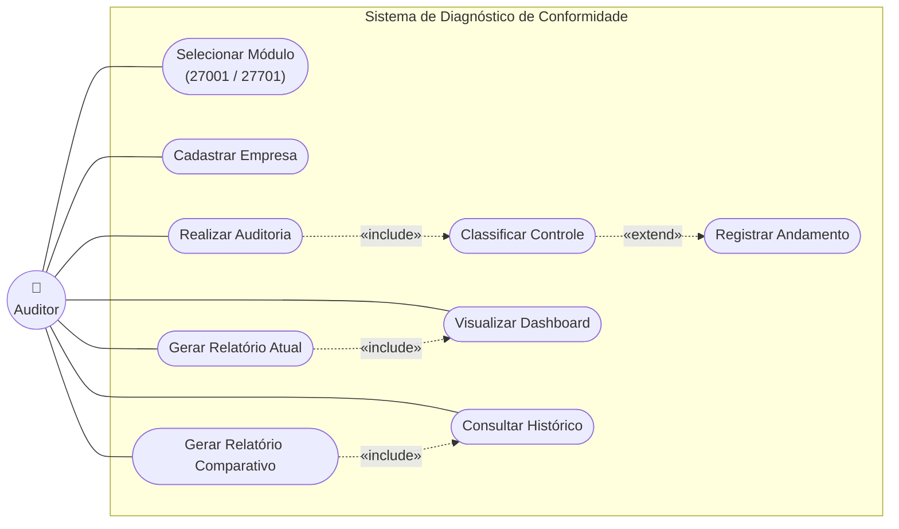
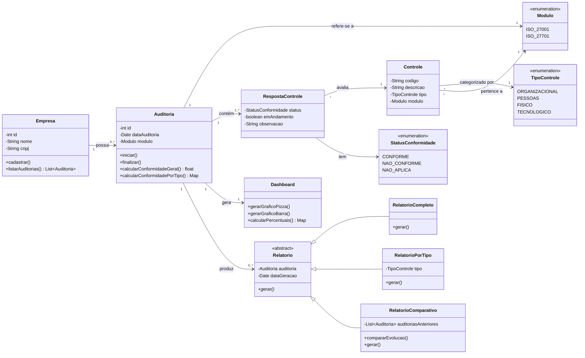
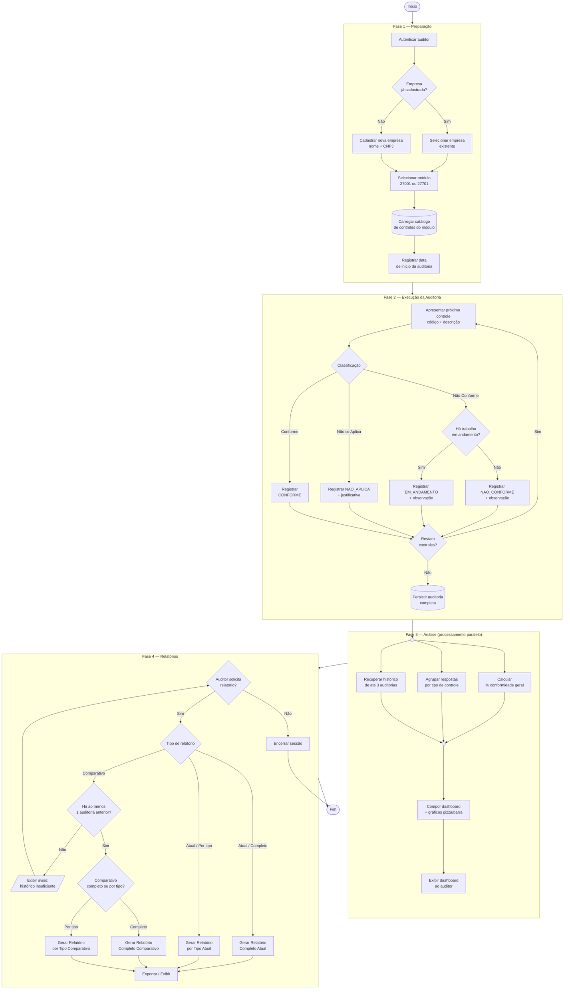

# Sistema de Diagnóstico de Conformidade ISO/IEC 27001 e 27701

> **Projeto de Segurança I (PSI)**\: Ferramenta para diagnóstico de conformidade com as normas **ABNT NBR ISO/IEC 27001** (Sistema de Gestão de Segurança da Informação) e **ABNT NBR ISO/IEC 27701** (Sistema de Gestão da Privacidade da Informação), utilizando a **ABNT NBR ISO/IEC 27002** como base de avaliação para a conformidade da 27001.

---

## Sumário

- [Descrição do Sistema](#-descrição-do-sistema)
- [Objetivos](#-objetivos)
- [Requisitos Funcionais](#-requisitos-funcionais)
- [Requisitos Não Funcionais](#️-requisitos-não-funcionais)
- [Arquitetura Conceitual](#️-arquitetura-conceitual)
- [Diagramas UML](#-diagramas-uml)
  - [Diagrama de Casos de Uso](#diagrama-de-casos-de-uso)
  - [Diagrama de Classes](#diagrama-de-classes)
  - [Diagrama de Atividades](#diagrama-de-atividades)
- [Tecnologias](#️-tecnologias)
- [Referências](#-referências)

---

## Descrição do Sistema

O **Sistema de Diagnóstico de Conformidade ISO 27001/27701** é uma ferramenta acadêmica desenvolvida no contexto da disciplina **Projeto de Segurança I (PSI)** cujo objetivo é auxiliar auditores, profissionais de segurança da informação e responsáveis pelo programa de privacidade de uma organização a realizar **autoavaliações de conformidade** frente a duas das principais normas internacionais da família ISO/IEC 27000:

- **ABNT NBR ISO/IEC 27001**: Estabelece os requisitos para um Sistema de Gestão de Segurança da Informação (SGSI).
- **ABNT NBR ISO/IEC 27701:2026**: Estende a 27001 para a gestão da privacidade de informações pessoais, sendo a referência para um Sistema de Gestão da Privacidade da Informação (SGPI). É aplicável tanto a controladores quanto a operadores de dados pessoais (DP) e está mapeada à LGPD (Lei nº 13.709/2018).
- **ABNT NBR ISO/IEC 27002:2022**: Fornece o catálogo detalhado de controles utilizados como **base de diagnóstico** para a 27001, organizados em quatro temas (Organizacional, Pessoas, Físico e Tecnológico), totalizando 93 controles.

A ferramenta permite que o usuário **selecione o módulo de auditoria** (27001 ou 27701), informe os dados da empresa avaliada, percorra todos os controles aplicáveis e classifique cada um como **Conforme**, **Não Conforme** ou **Não se Aplica**. Quando um controle for considerado não conforme, o sistema registra também se existe **trabalho em andamento** para sua adequação. Ao final, os dados são consolidados em um **dashboard** com indicadores parciais (por tipo de controle) e geral de conformidade, além de permitir a geração de **relatórios** e **análise comparativa** com auditorias anteriores (até as 3 últimas).

---

## Objetivos

- Permitir a realização de auditorias internas guiadas, baseadas nos controles da ABNT NBR ISO/IEC 27002 e do Anexo A da ABNT NBR ISO/IEC 27701.
- Apoiar o diagnóstico de **conformidade** organizacional para 27001 (segurança) e 27701 (privacidade).
- Consolidar os resultados em **dashboard visual** com gráficos de conformidade total e por categoria.
- Manter o **histórico das três últimas auditorias** para análise de evolução.
- Gerar **relatórios** atuais e comparativos, completos ou segmentados por tipo de controle.

---

## Requisitos Funcionais

Os requisitos funcionais (RF) descrevem **o que o sistema deve fazer**, as funcionalidades observáveis pelo usuário final. Cada requisito abaixo está vinculado a um trecho do enunciado do PSI e/ou a uma cláusula normativa.

> 💡 *Clique em cada requisito para expandir os detalhes.*

<strong>RF01 - Seleção de Módulo Normativo</strong>

 

O sistema deve permitir que o usuário selecione, no início de cada auditoria, entre dois módulos mutuamente exclusivos: **ISO/IEC 27001** (segurança da informação) ou **ISO/IEC 27701** (privacidade da informação). A escolha do módulo determina o catálogo de controles que será carregado para a avaliação subsequente.

- **Prioridade:** Essencial
- **Origem:** PSI - "Um módulo para 27001 e outro para 27701"

<strong>RF02 - Carregamento do Catálogo de Controles</strong>

 

O sistema deve carregar automaticamente os controles aplicáveis ao módulo escolhido. Para o módulo **27001**, deve utilizar os 93 controles da **ISO/IEC 27002:2022**, distribuídos nos quatro temas (Organizacional, Pessoas, Físico e Tecnológico). Para o módulo **27701**, deve utilizar os controles do **Anexo A da ISO/IEC 27701:2026**, abrangendo as Tabelas A.1 (controladores), A.2 (operadores) e A.3 (considerações de segurança comuns).

- **Prioridade:** Essencial
- **Origem:** PSI - "Utilizar 27002 para diagnóstico da conformidade de 27001"

<strong>RF03 - Cadastro da Empresa Auditada</strong>

 

O sistema deve permitir o cadastro da organização sob avaliação, capturando, no mínimo, o **nome (razão social)** e o **CNPJ**. Empresas previamente cadastradas devem poder ser reutilizadas em novas auditorias sem necessidade de recadastro.

- **Prioridade:** Essencial
- **Origem:** PSI - "Perguntar nome da empresa"

<strong>RF04 - Registro da Data da Auditoria</strong>

 

O sistema deve registrar a data de realização da auditoria (preferencialmente capturada de forma automática), associando-a ao registro da auditoria para fins de rastreabilidade temporal e comparativo histórico.

- **Prioridade:** Essencial
- **Origem:** PSI - "Armazenar os dados e data de auditoria"

<strong>RF05 - Classificação Individual de Controles</strong>

 

Para cada controle apresentado, o sistema deve permitir que o auditor atribua **uma única** das três classificações mutuamente exclusivas: **Conforme**, **Não Conforme** ou **Não se Aplica**. A classificação deve poder ser acompanhada de uma **observação textual opcional** justificando a decisão.

- **Prioridade:** Essencial
- **Origem:** PSI - "Para cada controle, perguntar se está conforme ou não está conforme ou não se aplica"

<strong>RF06 - Registro de Trabalho em Andamento para Não Conformidades</strong>

 

Sempre que um controle for classificado como **Não Conforme**, o sistema deve perguntar se há **trabalho em andamento** para a sua adequação. A resposta (Sim/Não) deve ser armazenada como atributo da resposta ao controle, permitindo distinguir não conformidades já em remediação daquelas ainda sem tratamento.

- **Prioridade:** Essencial
- **Origem:** PSI - "Caso não esteja conforme, perguntar se existe alguma trabalho em andamento"

<strong>RF07 - Persistência da Auditoria</strong>

 

Ao finalizar a avaliação dos controles, o sistema deve **persistir** todos os dados da auditoria (empresa, módulo, data, respostas, observações) em armazenamento durável, garantindo que possam ser recuperados em sessões posteriores.

- **Prioridade:** Essencial
- **Origem:** PSI - "Armazenar os dados"

<strong>RF08 - Manutenção de Histórico das 3 Últimas Auditorias</strong>

 

O sistema deve preservar, por combinação de **empresa + módulo**, o registro das **três auditorias mais recentes** para fins de comparativo evolutivo. Registros mais antigos podem ser arquivados, descartados ou ficar inacessíveis ao módulo de comparação.

- **Prioridade:** Essencial
- **Origem:** PSI - "Armazenar os dados e data de auditoria para efeitos comparativos (3 últimas auditorias)"

<strong>RF09 - Cálculo da Conformidade Geral</strong>

 

O sistema deve calcular o **percentual geral de conformidade** da auditoria, definido como a razão entre o número de controles classificados como "Conforme" e o total de controles **aplicáveis** (excluindo do denominador os classificados como "Não se Aplica").

- **Prioridade:** Essencial

<strong>RF10 - Cálculo da Conformidade por Tipo de Controle</strong>

 

O sistema deve calcular percentuais **parciais** de conformidade segregados por **tipo de controle**, conforme a taxonomia adotada pelo módulo: as quatro categorias da ISO/IEC 27002 para o módulo 27001 (Organizacional, Pessoas, Físico, Tecnológico) ou as categorias do Anexo A da ISO/IEC 27701 para o módulo de privacidade.

- **Prioridade:** Essencial
- **Origem:** PSI - "Agrupar os dados por tipos de controle (27002)"

<strong>RF11 - Dashboard de Conformidade</strong>

 

O sistema deve apresentar um **painel consolidado (dashboard)** exibindo simultaneamente: (i) o percentual geral de conformidade, (ii) os percentuais parciais por tipo de controle, e (iii) elementos gráficos que facilitem a leitura visual dos resultados.

- **Prioridade:** Essencial
- **Origem:** PSI - "Apresentar os dados no formato de dashboard"

<strong>RF12 - Visualização Gráfica dos Resultados</strong>

 

O dashboard deve oferecer pelo menos **dois tipos de gráficos**: um gráfico de **pizza** (ou rosca) representando a distribuição entre Conforme / Não Conforme / Não se Aplica, e um gráfico de **barras** comparando o percentual de conformidade entre os tipos de controle.

- **Prioridade:** Importante
- **Origem:** PSI - "gráficos (pizza ou barra)"

<strong>RF13 - Geração de Relatório por Tipo de Controle</strong>

 

O sistema deve permitir gerar um **relatório segmentado por categoria de controle**, listando para cada tipo todos os controles avaliados, sua classificação, indicação de trabalho em andamento (quando aplicável) e observações registradas pelo auditor.

- **Prioridade:** Essencial
- **Origem:** PSI - "Apresentar relatórios por tipos de controle"

<strong>RF14 - Geração de Relatório Completo</strong>

 

O sistema deve permitir gerar um **relatório completo** consolidando todos os controles avaliados na auditoria atual, em ordem de catálogo, com classificação, indicação de andamento e observações.

- **Prioridade:** Essencial
- **Origem:** PSI - "relatório completo de conformidade"

<strong>RF15 - Geração de Relatório Comparativo</strong>

 

O sistema deve permitir gerar **relatórios comparativos** confrontando a auditoria atual com as anteriores (até as 3 últimas) da mesma empresa e módulo, evidenciando a **evolução** dos indicadores de conformidade. O comparativo deve estar disponível tanto para o formato por tipo quanto para o completo.

- **Prioridade:** Essencial
- **Origem:** PSI - "Funcionalidade de comparativo / mostrar evolução de conformidade"

<strong>RF16 - Restrição Temporal para Geração de Relatórios</strong>

 

A funcionalidade de relatórios deve estar disponível **somente após a conclusão (finalização)** da auditoria corrente. Auditorias em andamento não podem produzir relatórios definitivos, apenas pré-visualizações de progresso.

- **Prioridade:** Importante
- **Origem:** PSI - "Relatórios (somente após a conclusão de auditoria)"

---

## Requisitos Não Funcionais

Os requisitos não funcionais (RNF) descrevem **atributos de qualidade** do sistema, como ele deve se comportar e quais restrições deve respeitar.

> 💡 *Clique em cada requisito para expandir os detalhes.*

<strong>RNF01 - Usabilidade</strong>

 

Considerando que uma auditoria 27001 envolve a avaliação sequencial de até 93 controles (e a 27701 pode envolver número equivalente ou superior), a interface deve ser **clara, objetiva e de baixa carga cognitiva**. Cada controle deve ser apresentado com seu código, título, descrição original da norma e os três botões de classificação visíveis simultaneamente, sem necessidade de rolagem excessiva.

<strong>RNF02 - Confiabilidade dos Dados</strong>

 

Nenhum dado de auditoria pode ser **perdido entre sessões** ou em caso de falha de aplicação durante o preenchimento. Recomenda-se persistência incremental (salvamento automático a cada controle respondido) e mecanismo de recuperação de auditoria em andamento.

<strong>RNF03 - Segurança da Aplicação</strong>

 

Por tratar de dados sensíveis de auditoria, o próprio sistema deve seguir boas práticas de segurança alinhadas à ISO/IEC 27002, incluindo:

- **Autenticação** de usuários antes do acesso a auditorias.
- **Controle de acesso** restringindo a visualização de auditorias por empresa/perfil.
- **Registro de eventos (log)** das ações relevantes (criação, edição, exclusão de auditorias e relatórios).
- **Backup periódico** dos dados persistidos.

<strong>RNF04 - Conformidade Normativa do Catálogo</strong>

 

O catálogo de controles embutido na ferramenta deve refletir as **edições vigentes** das normas de referência: ABNT NBR ISO/IEC 27002:2022 e ABNT NBR ISO/IEC 27701:2026. Quaisquer atualizações normativas devem poder ser incorporadas por meio de atualização do catálogo, sem necessidade de retrabalho nos dados históricos.

<strong>RNF05 - Performance e Tempo de Resposta</strong>

 

Operações de leitura (carregamento de controles, exibição do dashboard, recuperação de histórico) devem responder em até **2 segundos** em uma carga típica de uso. A geração de relatórios e gráficos comparativos pode admitir tempos maiores (até 5 segundos), por envolver agregação histórica.

<strong>RNF06 - Portabilidade</strong>

 

O sistema deve poder ser executado em ambientes de uso comum em organizações (navegadores web modernos ou plataformas desktop multiplataforma), sem dependência de sistema operacional específico para a interface do usuário.

<strong>RNF07 - Manutenibilidade</strong>

 

A separação clara entre o **catálogo de controles** (dados normativos), as **regras de cálculo de conformidade** (lógica de domínio) e a **camada de persistência** deve permitir que evoluções em uma camada não impactem desnecessariamente as demais. A arquitetura é guiada pelo princípio de **separação de responsabilidades**.

<strong>RNF08 - Auditabilidade</strong>

 

Sendo a aplicação uma ferramenta de auditoria, o próprio sistema deve ser **auditável**: cada resposta registrada deve ser inalterável após o fechamento da auditoria, e qualquer alteração subsequente (caso permitida administrativamente) deve gerar trilha de auditoria com autor, data e justificativa.

<strong>RNF09 - Idioma e Localização</strong>

 

A interface, o catálogo de controles e os relatórios gerados devem estar em **português brasileiro**, refletindo a terminologia adotada pelas normas ABNT NBR e pela LGPD (por exemplo: "dados pessoais" em vez de "PII", "operador" e "controlador" em vez de "processor" e "controller").

<strong>RNF10 - Privacidade dos Dados de Auditoria</strong>

 

Os dados de auditoria, embora não sejam dados pessoais em sentido estrito, podem conter informações sensíveis sobre a postura de segurança das organizações avaliadas. O sistema deve adotar boas práticas de **minimização**, **controle de acesso** e **proteção em repouso** — coerentes com as próprias normas que ele ajuda a avaliar.

---

## Arquitetura Conceitual

O sistema é estruturado em camadas:

- **Apresentação**: Interface do usuário (formulários de auditoria, dashboard e relatórios).
- **Aplicação / Domínio**: Regras de negócio: classificação de controles, cálculo de percentuais de conformidade, comparação histórica.
- **Persistência**: Armazenamento das auditorias, respostas e metadados (data, empresa, módulo).

A separação entre **módulos** (27001 e 27701) e **tipos de controle** (categorias da 27002 e do Anexo A da 27701) é refletida diretamente no modelo de classes apresentado adiante.

---

## Diagramas UML

### Diagrama de Casos de Uso

Apresenta as interações entre o ator principal (**Auditor**) e as funcionalidades do sistema.

**Notas de leitura:**
- `«include»` indica que o caso de uso é **sempre** executado como parte do caso de uso de origem.
- `«extend»` indica execução **condicional** (somente quando o controle é "Não Conforme").

---

### Diagrama de Classes

Modelo de domínio do sistema. As enumerações representam valores fixos definidos pelas normas.

**Principais relacionamentos:**
- Uma `Empresa` pode ter **várias** `Auditorias` (limitadas a 3 últimas para fins comparativos).
- Cada `Auditoria` está vinculada a **um único** `Modulo` (27001 **ou** 27701).
- Cada `RespostaControle` referencia **um** `Controle` e armazena seu `StatusConformidade`.
- `Relatorio` é uma classe abstrata especializada em três tipos concretos.

---

### Diagrama de Atividades

O fluxo da ferramenta foi organizado em **quatro fases lógicas** (Preparação, Execução, Análise e Relatórios), com **processamento paralelo** na fase de análise (cálculo de indicadores, agrupamento e geração de gráficos ocorrem concorrentemente) e **tratamento de exceção** quando não há histórico suficiente para comparativo.

**Pontos de atenção do fluxo:**
- A **Fase 3** modela explicitamente o paralelismo entre cálculo de indicadores, agrupamento de dados e recuperação do histórico, operações independentes que podem ocorrer concorrentemente antes da composição do dashboard.
- A **Fase 4** trata a exceção em que o auditor solicita relatório comparativo sem ter histórico suficiente armazenado, retornando o fluxo para o ponto de decisão em vez de quebrar a operação.
- A persistência ocorre **apenas após o fechamento da auditoria** (E9), atendendo ao RNF02 e ao RF16.

---

## Tecnologias

- **Linguagens BackEnd:** Golang, PocketBase, SQLite.
- **Linguagens FrontEnd:** Next.js, React, Tailwind, Shacnui.
- **Envio de e-mail:** API Resend
- **Integração com IA:** Google Gemini API
- **Visualização (gráficos):** Recharts

---

## Referências

- **ABNT NBR ISO/IEC 27002:2022** - *Segurança da informação, segurança cibernética e proteção da privacidade - Controles de segurança da informação.* Rio de Janeiro: ABNT, 2022.

- **ABNT NBR ISO/IEC 27701:2026** - *Segurança da informação, segurança cibernética e proteção da privacidade - Sistemas de gestão da privacidade da informação - Requisitos e orientações.* 2ª edição. Rio de Janeiro: ABNT, 22 jan. 2026. 90 p. ICS 03.100.70; 35.030. Adoção idêntica da ISO/IEC 27701:2025. Cancela e substitui a ABNT NBR ISO/IEC 27701:2020.

---

*Projeto desenvolvido para fins acadêmicos na disciplina de Projeto de Segurança I (PSI) - apresentações nos dias 25 e 26 de maio.*
